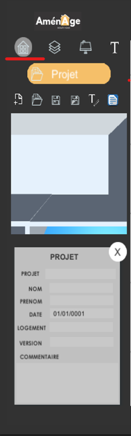

# Création d'un Projet

Pour Commencer Un nouveau Projet Sélectionner Dans Le Menu principal :

En le sélectionnant vous aurais accès a une fiche "Projet" en bas de l'image ci dessus ou vous pouvez y remplir :

* Le nom de votre projet \*
* Votre nom et prénom
* La date de votre réalisation
* L'adresse du logement 
* La version de votre projet 


'\*' Champ Obligatoire



Le mieux reste de remplir le plus de champs possible 😁 


Vous pouvez **Sauvegarder** le projet a l'aide de l'icone ci dessous ou avec **ctrl + s** 

