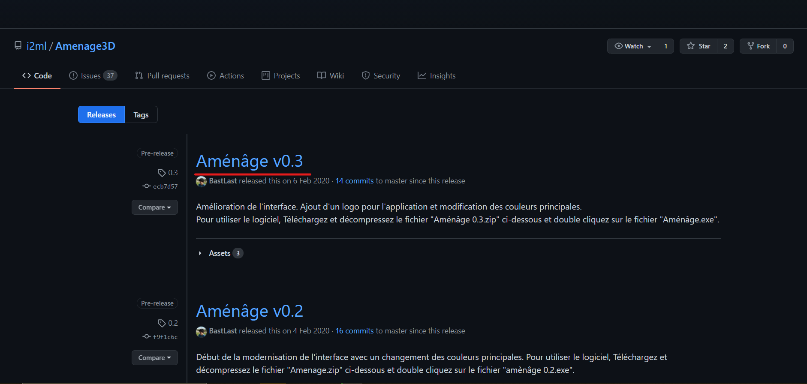
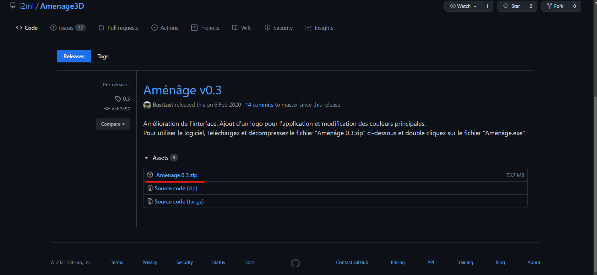
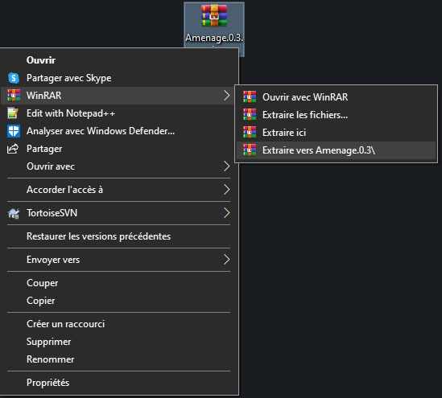
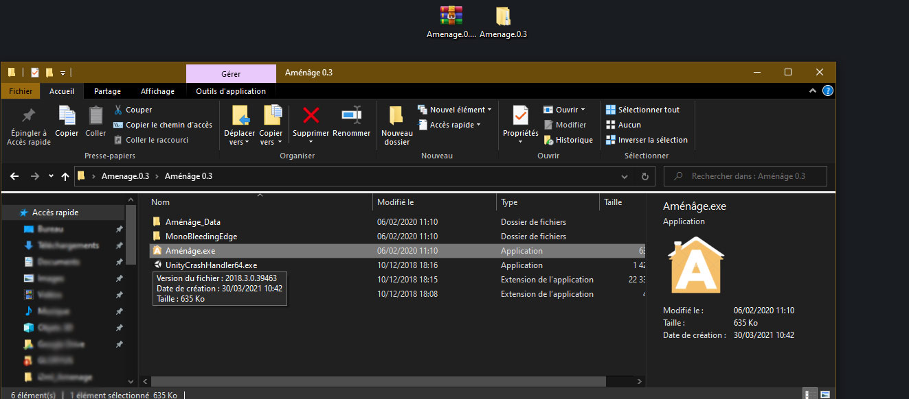
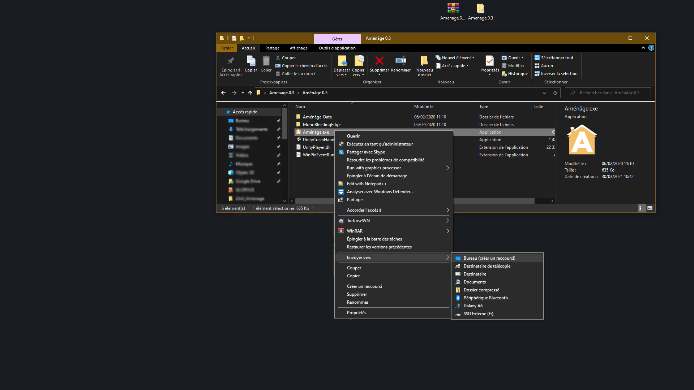

# Installation du logiciel

## Téléchargement du logiciel 


Il vous faudra un logiciel de Zip comme **Winrar** ou **Zzip** Si vous n'est pas sur **Windows 10**

Vous pouvez retrouver le lien de téléchargements de c'est logiciel dans liens utiles. 




Vous devez tout d'abord Télécharger Aménage depuis le site [https://amenage.i2ml.fr/3d](https://amenage.i2ml.fr/3d)\*\*\*\*

Il vous faudra prendre la dernière version disponible ou celle qui vous convient, dans notre cas **Aménage v0.3** :

**Télécharger** le .zip :

Une fois télécharger, dézipper le dossier sur votre ordinateur dans un dossier préalablement créé : 

Pour lancer l'installation, vous devez exécuter le fichier .exe :

## Création d'un raccourcis Bureau \(facultatif\)

Si vous souhaitez  y avoir accès depuis n'importe où, les raccourcis sont pratiques 

Faite **clique droit sur le .exe, Envoyer vers , Bureau :**

Vous devez maintenant avoir un raccourci sur le bureau.

Une fois arrivé sur l'interface du logiciel nous vous invitons à poursuivre le guide utilisateur en cliquant sur le lien ci-dessous.



