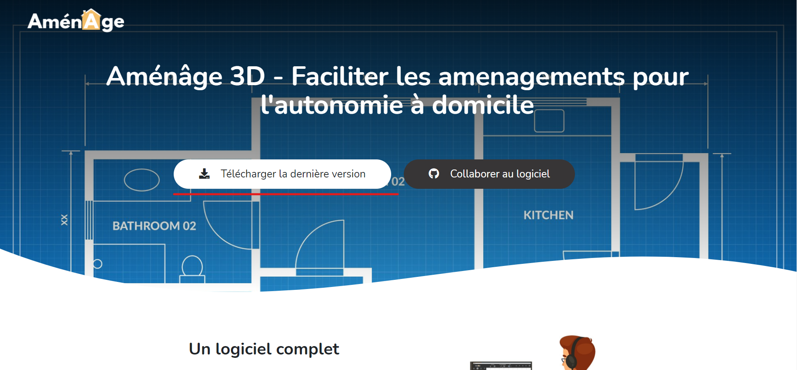

# Installation du logiciel

## Téléchargement du logiciel 

Vous devez tout d'abord [Télécharger ](https://amenage.i2ml.fr/3d)[Aménage ](https://amenage.i2ml.fr/3d): [https://amenage.i2ml.fr/3d](https://amenage.i2ml.fr/3d)

Il vous suffit d'installer le logiciel en suivant le programme d'installation.

Une fois Installer nous vous proposons de passer à "**Création d'un projet**" ci-dessous :



