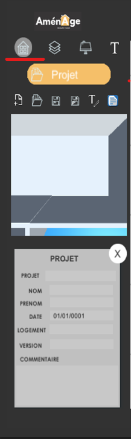
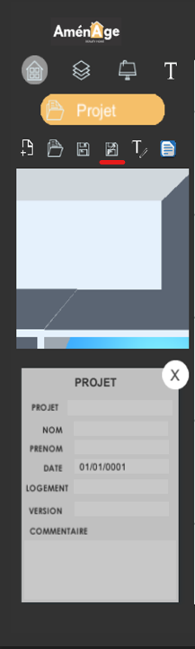

# Création d'un Projet

**Au départ**, pour éviter tous problèmes pour la suite des opérations, il vous faudra **renseigner** les **champs** suivant dans le **premier onglets** "Projets" du menu principal.

Un **sous-menu** s'affiche avec des **champs vide** à remplir. Dans l'ordre de haut en bas, les champs correspondent à :

* Le **nom** de votre projet.
* Votre **nom**.
* Votre **prénom**
* La **date** de réalisation de votre projet.
* **L'adresse** du logement.
* La **version** de votre projet.
* Un **commentaire, une remarque** sur le projet \(facultatif\).


Plus les champs seront remplis plus votre sauvegarde sera claire et précise lors de l'export.


Afin de **sauvegarder** votre projet, il vous faudra **cliquer** sur le bouton comme indiqué ci-dessous ou faire le raccourcis **ctrl + s**. Une fenêtre s'ouvrira et il faudra **enregistrer** le fichier **.json** dans un endroit où vous pourrez y **avoir accès facilement**.

Une fois le projet **créer** et **enregistrer** vous êtes prêt pour la suite du tutoriel :



