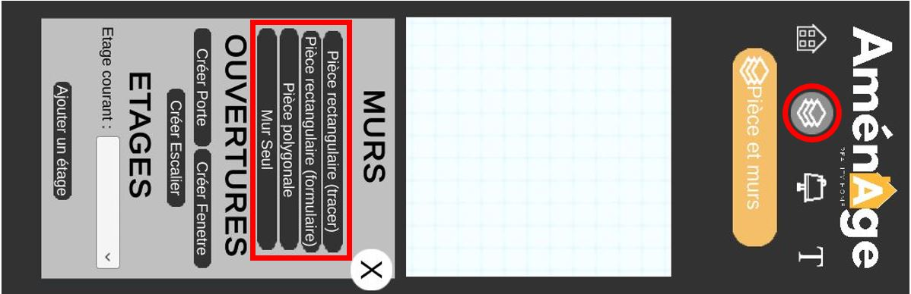
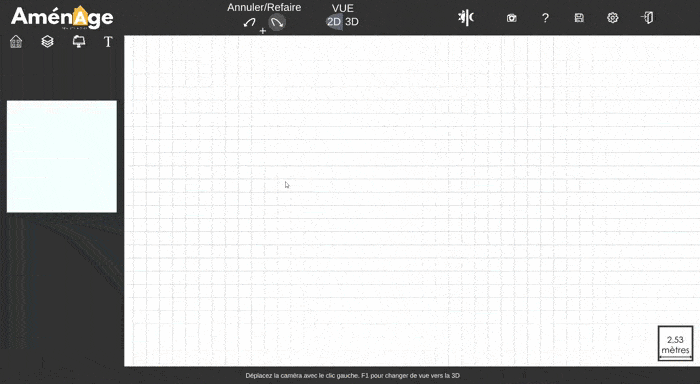
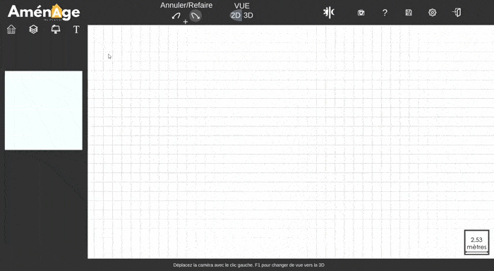

# Créer sa première pièce

Pour **créer une pièce**, rien de plus simple, il vous suffit **d'ouvrir le deuxième menu** et de **sélectionner** l'un des quatre type de mur :  

-**Pièce rectangulaire** \(tracer\), vous permet simplement de **former** une **pièce composer** de **quatre** murs en un coup.

  
-**Pièce rectangulaire** \(formulaire\), vous permet de **générer** une pièce à partir de **mesure précise**.

  
-**Pièce polygonale**, vous permet de **créer** votre pièce **mur par mur** afin de reproduire votre environnement comme vous le souhaitez.

  
-**Mur seul**, vous permet de **tracer un mur** à **travers** votre **pièce principale** pour la séparer en deux.

