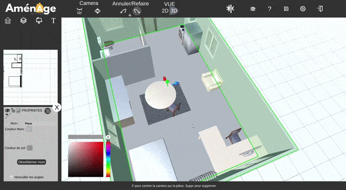

# Décorer votre logement

En plus de la liste divers et variée de meubles, vous pouvez **changer** la **couleur** des **murs** en **cliquant** simplement sur **le mur en question** ou bien en **sélectionnant le sol** de votre pièce ce qui aura pour effet de **changer la couleur** des quatre murs de votre pièce **en même temps**, vous aurez la possibilité de **changer** également **la couleur du sol**.

