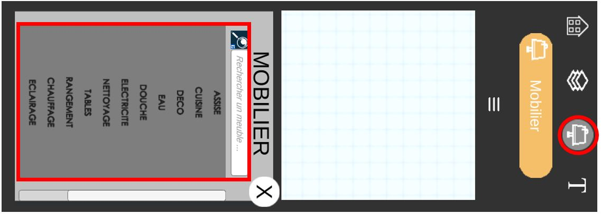

# Mettre ses premiers meubles

Pour **placer** vos premiers meubles rien de plus simple, rendez-vous dans le **troisième** onglet du **menu principal** et vous pourrez apercevoir une **liste de meubles** qui vous permettrons **d'aménager votre logement**.

Avec la **multitude de meubles** mis à votre disposition vous pouvez **personnaliser** votre **logement** comme bon vous semble.

