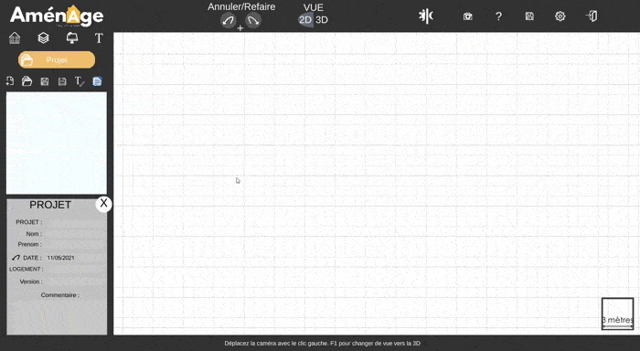

# Ouvrir un projet existant

Pour récupérer votre projet cliquez sur le deuxième icône comme fait ci-dessous. Un explorateur de fichier s'ouvrira et vous pourrait sélectionner la sauvegarde en .json que vous souhaitez.

