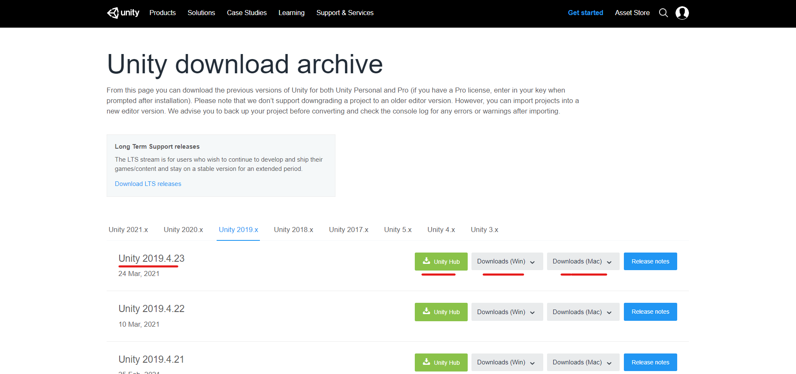
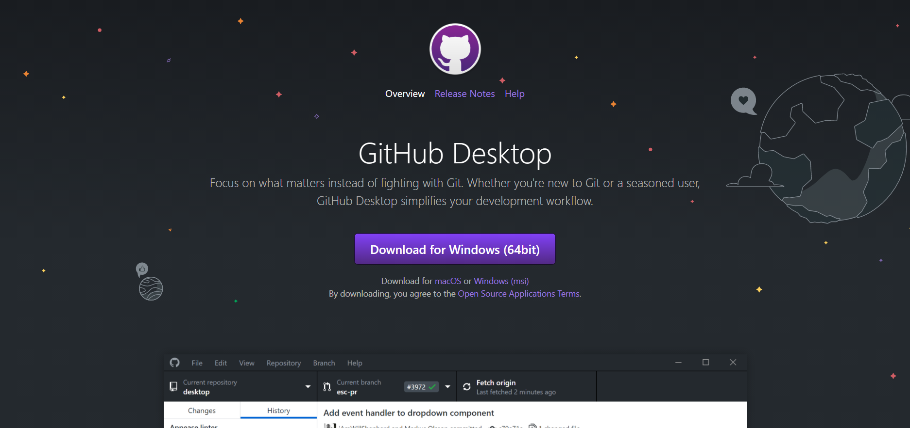
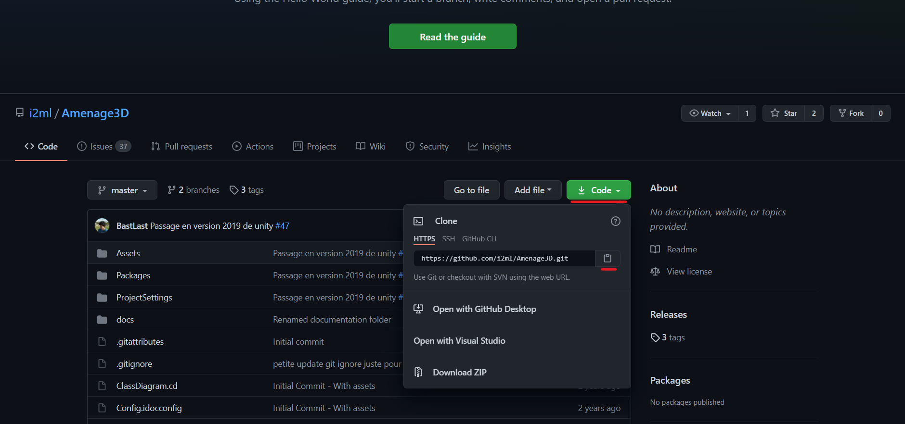

# Installation du logiciel pour du développement

Pour commencer Il vous faudra **Unity 2019.4.23** : [https://unity3d.com/get-unity/download/archive](https://unity3d.com/get-unity/download/archive)

**Il vous faudra une interface Git :**

nous vous proposons git desktop : [https://desktop.github.com/](https://desktop.github.com/) 

Il vous suffira de copier le dépôt ici : [https://github.com/i2ml/Amenage3D](https://github.com/i2ml/Amenage3D)

