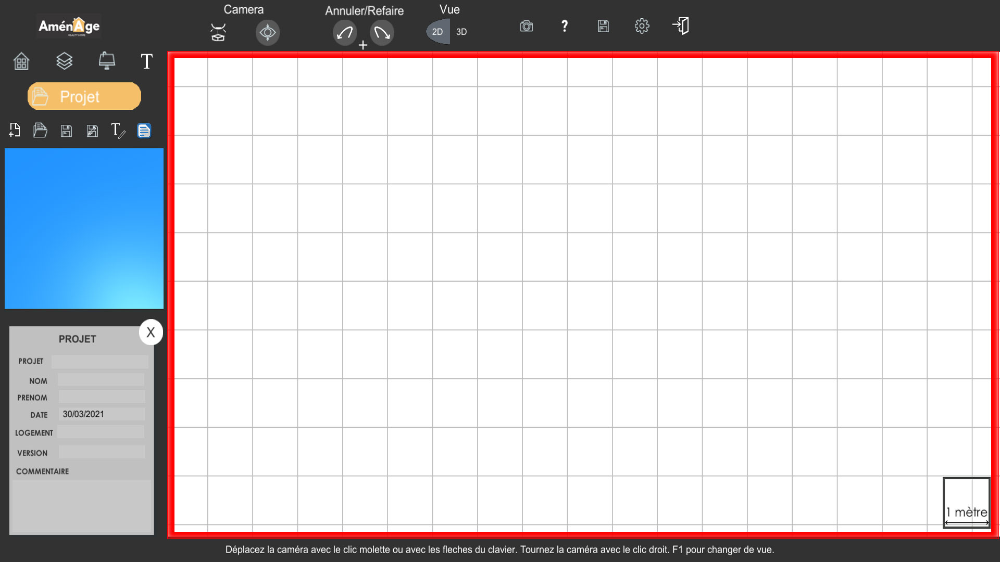
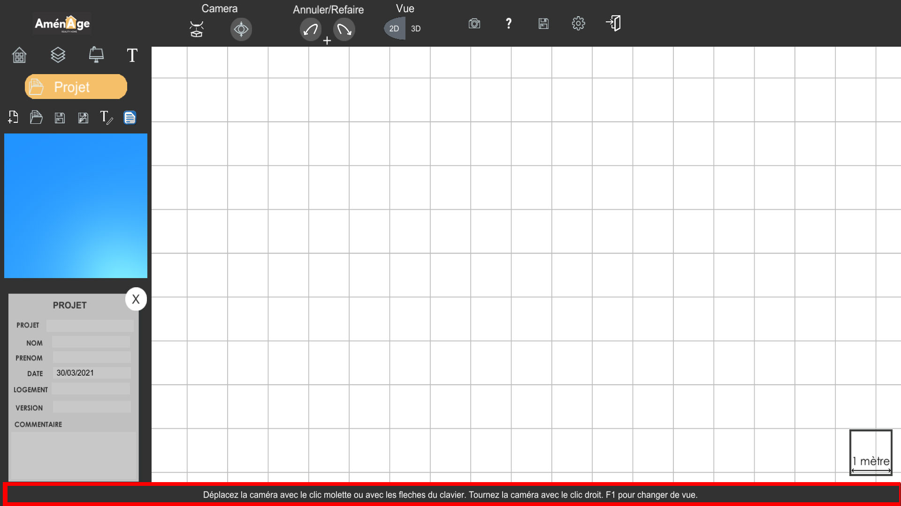
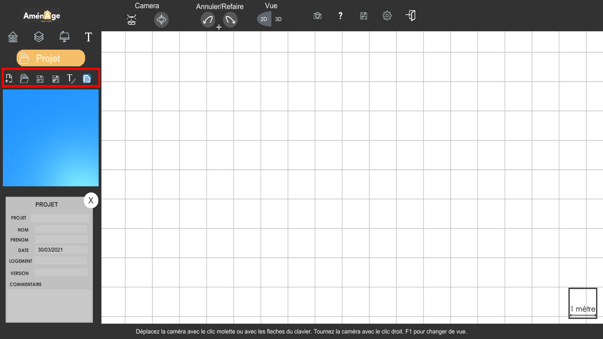
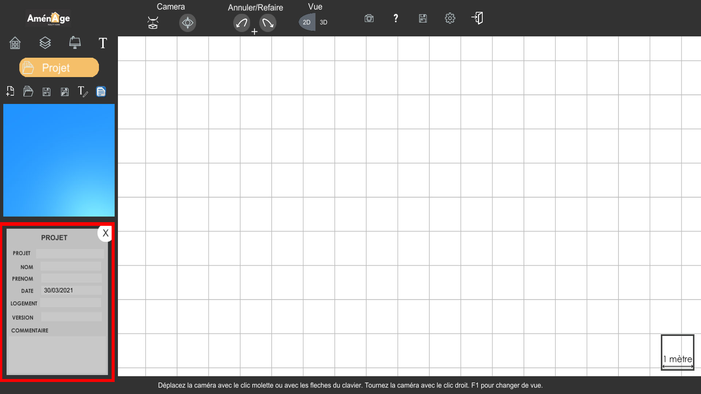
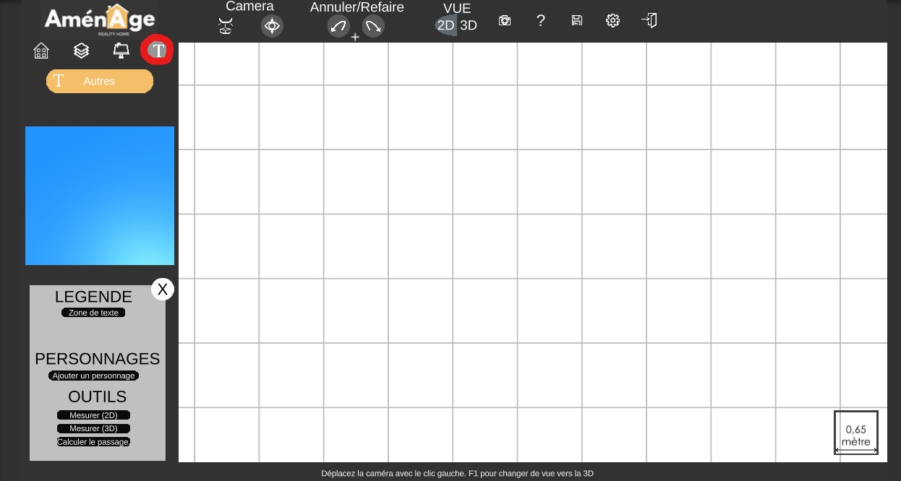

# Présentation générale de l'interface


Ce guide vous permettra de gagner beaucoup de temps pour la prise en main du logiciel. Il vous est, par conséquent, fortement conseillé.


## Les différents point de vue :

Nous allons voir l'ensemble de **l'interface** ensemble ici, commençons par la **vue principale** ici en **rouge** la vue quadrillée est la **vue 2D.**   

Vous pouvez changer cette **vue principale** en une **vue 3D** que l'on peut apercevoir dans l'encadrement à gauche sur la capture ci-dessous. Pour se faire, il vous suffit soit **de cliquer sur le cadre à gauche**, soit **d'utiliser les boutons 2D/3D** prévu à cet effet tout en haut de l'interface**. Toutes les modifications** que vous apporterez, sur l'une ou l'autre des scènes, **seront visibles directement** sur l'autre scène grâce à **ce petit cadre**. 

## **Le menu principal**

Vous trouverez en haut à gauche le **menu** qui vous servira à **naviguer** entre les **différentes fonctionnalités du logiciel.** 

il vous permet dans l'ordre de gauche à droite de :  

* Accéder aux **informations du projet.**
* Créer **des salles**, **des murs**, **des portes**, **des fenêtres** ou encore **des étages**.
* Aménager vos pièces avec des **meubles divers et variés**.
* Rajouter des **commentaires** ainsi que de réaliser des **mesures** sur les différentes scènes.  

**Une infobulle** vous indique en permanence **l'utilité du bouton** que vous **survolez**. Dans le cas où vous ne survolez pas de bouton, elle vous indiquera comment **vous déplacer** **dans la scène** principale que ce soit en 3D ou en 2D.

Dans **le menu projet** vous pouvez retrouver une liste de boutons vous permettant de : 

* **Créer** un nouveau **projet vierge.**
* **Charger un fichier** précédemment enregistrer.
* **Enregistrer** votre sauvegarde en cours \(plus communément appelé "**Enregistrer**"\).
* **Enregistrer** sous un nom précis votre projet sur votre ordinateur \(plus communément appelé "**Enregistrer sous**"\).
* **Exporter** le projet **au format .txt** avec un récapitulatif des meubles générés et des pièces créées.
* **Exporter** le projet **au format .odt**.

  .

**Chaque boutons** du menu emmènent à un **sous-menu différent.** Par exemple, le bouton Projet \(celui tout en haut à gauche\) permet **d'afficher** le **sous-menu encadré** en rouge ci-dessous. Les **champs** sont à **renseigner** pour assurer **la bonne sauvegarde** de votre **projet**.

-Si l'on **clique** sur le **deuxième bouton**, le **menu de création** des murs/pièces/portes/fenêtres/étages s'ouvre nous permettant de réalisé ces derniers.

-Si l'on **clique** sur le **troisième bouton,** la **liste du mobilier** est affichée ce qui vous permettra **d'aménager** votre projet.

-Si l'on **clique** sur le **quatrième bouton**, vous pouvez **créer des zones de texte** afin de **structurer** la création de **votre bien,** vous pouvez également **réaliser des mesures** sur vos scènes.

## Le menu secondaire

le menu secondaire est une barre située en haut de l'encrant permettant d'accéder à des fonctionnalités rapides telles que \(de gauche à droite\):

* **Revenir** à l'action **précédente** ou **suivante** si vous êtes déjà revenu en arrière.
* **Changer** de vue entre 2D et 3D.
* **Prendre** une capture d'écran.
* **Afficher** une **liste d'aide** avec des raccourcis utiles ainsi que **l'explication** de certains logos.
* **Sauvegarder** le **projet** en **cours**.
* **Ouvrir** le menu des **paramètres**.
* **Quitter** l'application.

Après avoir survolez **les fonctionnalités de l'interface du logiciel**, nous allons maintenant voir plus en détail **les fonctionnalités énoncées précédemment**.



